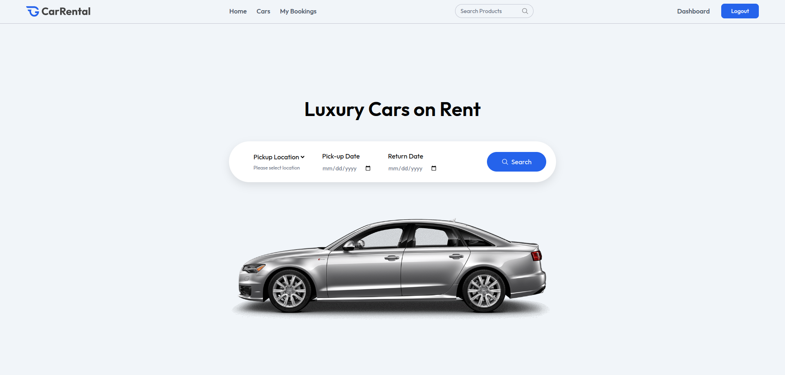

# 🚗 Car Rental System

A full-stack MERN (MongoDB, Express.js, React.js, Node.js) car rental application that provides a seamless experience for both car owners and renters. The application features a modern, responsive design with real-time booking management, user authentication, and an intuitive dashboard for car owners.



## 📋 Table of Contents

- [Features](#-features)
- [Tech Stack](#-tech-stack)
- [Project Structure](#-project-structure)
- [Screenshots](#-screenshots)
- [Installation](#-installation)
- [Usage](#-usage)
- [API Endpoints](#-api-endpoints)
- [Environment Variables](#-environment-variables)
- [Deployment](#-deployment)
- [Contributing](#-contributing)
- [License](#-license)

## ✨ Features

### For Users
- 🔐 **User Authentication**: Secure login/signup system
- 🚗 **Browse Cars**: View available cars with detailed information
- 🔍 **Search & Filter**: Find cars by location, price, and features
- 📅 **Booking System**: Easy car booking with date selection
- 💳 **Booking Management**: View and manage your bookings
- 📱 **Responsive Design**: Works seamlessly on all devices
- ⭐ **User Reviews**: Read testimonials from other users

### For Car Owners
- 🏠 **Owner Dashboard**: Comprehensive overview of business
- ➕ **Add Cars**: Upload car details with images
- 📊 **Manage Cars**: Edit, delete, and track car listings
- 📋 **Booking Management**: Handle incoming booking requests
- 📈 **Analytics**: View booking statistics and earnings
- 🔒 **Secure Access**: Protected owner-only routes

### Technical Features
- 🎨 **Modern UI**: Built with Tailwind CSS and React
- ⚡ **Fast Performance**: Optimized with Vite
- 🔄 **Real-time Updates**: Dynamic content updates
- 📸 **Image Upload**: Cloud storage with ImageKit
- 🔐 **JWT Authentication**: Secure token-based auth
- 🗄️ **MongoDB Database**: Scalable data storage
- 🚀 **RESTful API**: Clean and efficient backend

## 🛠️ Tech Stack

### Frontend
- **React.js** - UI library
- **Vite** - Build tool and dev server
- **Tailwind CSS** - Utility-first CSS framework
- **React Router DOM** - Client-side routing
- **Axios** - HTTP client
- **React Hot Toast** - Toast notifications
- **Lucide React** - Icon library
- **Motion** - Animation library

### Backend
- **Node.js** - Runtime environment
- **Express.js** - Web framework
- **MongoDB** - NoSQL database
- **Mongoose** - MongoDB object modeling
- **JWT** - Authentication
- **bcrypt** - Password hashing
- **Multer** - File upload handling
- **ImageKit** - Cloud image storage
- **CORS** - Cross-origin resource sharing

## 📁 Project Structure

```
car_rental/
├── client/                 # Frontend React application
│   ├── src/
│   │   ├── components/     # Reusable UI components
│   │   ├── pages/         # Page components
│   │   ├── context/       # React context for state management
│   │   ├── assets/        # Images and static files
│   │   └── main.jsx       # Application entry point
│   ├── package.json
│   └── vite.config.js
├── server/                # Backend Node.js application
│   ├── configs/          # Database and service configurations
│   ├── controllers/      # Request handlers
│   ├── middleware/       # Custom middleware
│   ├── models/          # MongoDB schemas
│   ├── routes/          # API routes
│   ├── server.js        # Server entry point
│   └── package.json
└── README.md
```

## 📸 Screenshots

### Homepage


### Car Listing


### Car Details


### User Dashboard


### Owner Dashboard


### Add Car Form


### Manage Cars


### Booking Management


## 🚀 Installation

### Prerequisites
- Node.js (v16 or higher)
- MongoDB (local or cloud instance)
- npm or yarn package manager

### Step 1: Clone the Repository
```bash
git clone https://github.com/yourusername/car-rental.git
cd car-rental
```

### Step 2: Install Dependencies

#### Backend Setup
```bash
cd server
npm install
```

#### Frontend Setup
```bash
cd ../client
npm install
```

### Step 3: Environment Configuration

Create `.env` file in the server directory:
```env
PORT=3000
MONGODB_URI=your_mongodb_connection_string
JWT_SECRET=your_jwt_secret_key
IMAGEKIT_PUBLIC_KEY=your_imagekit_public_key
IMAGEKIT_PRIVATE_KEY=your_imagekit_private_key
IMAGEKIT_URL_ENDPOINT=your_imagekit_url_endpoint
```

### Step 4: Start the Application

#### Start Backend Server
```bash
cd server
npm run server
```

#### Start Frontend Development Server
```bash
cd client
npm run dev
```

The application will be available at:
- Frontend: `http://localhost:5173`
- Backend API: `http://localhost:3000`

## 📖 Usage

### For Users
1. **Register/Login**: Create an account or sign in
2. **Browse Cars**: Explore available cars on the homepage
3. **Search Cars**: Use filters to find specific cars
4. **View Details**: Click on a car to see detailed information
5. **Book a Car**: Select dates and complete booking
6. **Manage Bookings**: View your booking history

### For Car Owners
1. **Owner Login**: Access the owner dashboard
2. **Add Cars**: Upload car details and images
3. **Manage Inventory**: Edit or remove car listings
4. **Handle Bookings**: Accept or reject booking requests
5. **View Analytics**: Monitor business performance

## 🔌 API Endpoints

### User Routes (`/api/user`)
- `POST /register` - User registration
- `POST /login` - User login
- `GET /profile` - Get user profile
- `PUT /profile` - Update user profile

### Owner Routes (`/api/owner`)
- `POST /register` - Owner registration
- `POST /login` - Owner login
- `POST /add-car` - Add new car
- `GET /cars` - Get owner's cars
- `PUT /cars/:id` - Update car details
- `DELETE /cars/:id` - Delete car

### Booking Routes (`/api/booking`)
- `POST /create` - Create new booking
- `GET /user-bookings` - Get user's bookings
- `GET /owner-bookings` - Get owner's bookings
- `PUT /:id/status` - Update booking status

## 🔧 Environment Variables

| Variable | Description | Required |
|----------|-------------|----------|
| `PORT` | Server port number | No (default: 3000) |
| `MONGODB_URI` | MongoDB connection string | Yes |
| `JWT_SECRET` | Secret key for JWT tokens | Yes |
| `IMAGEKIT_PUBLIC_KEY` | ImageKit public key | Yes |
| `IMAGEKIT_PRIVATE_KEY` | ImageKit private key | Yes |
| `IMAGEKIT_URL_ENDPOINT` | ImageKit URL endpoint | Yes |

## 🌐 Deployment

### Frontend Deployment (Vercel)
1. Connect your GitHub repository to Vercel
2. Set build command: `npm run build`
3. Set output directory: `dist`
4. Deploy

### Backend Deployment (Railway/Heroku)
1. Connect your repository
2. Set environment variables
3. Deploy the server directory

### Database
- Use MongoDB Atlas for cloud database
- Configure connection string in environment variables

## 🤝 Contributing

1. Fork the repository
2. Create a feature branch (`git checkout -b feature/AmazingFeature`)
3. Commit your changes (`git commit -m 'Add some AmazingFeature'`)
4. Push to the branch (`git push origin feature/AmazingFeature`)
5. Open a Pull Request

### Development Guidelines
- Follow ESLint rules
- Write meaningful commit messages
- Test your changes thoroughly
- Update documentation if needed

## 📝 License

This project is licensed under the MIT License - see the [LICENSE](LICENSE) file for details.

## 👨‍💻 Author

**Your Name**
- GitHub: [@yourusername](https://github.com/yourusername)
- LinkedIn: [Your LinkedIn](https://linkedin.com/in/yourprofile)

## 🙏 Acknowledgments

- [React](https://reactjs.org/) - Frontend framework
- [Express.js](https://expressjs.com/) - Backend framework
- [MongoDB](https://www.mongodb.com/) - Database
- [Tailwind CSS](https://tailwindcss.com/) - CSS framework
- [Vite](https://vitejs.dev/) - Build tool
- [ImageKit](https://imagekit.io/) - Image storage

---

⭐ **Star this repository if you found it helpful!** 